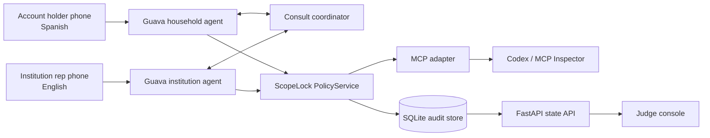

# ScopeLock

### ScopeLock: a bilingual voice advocate that can make the call without taking away the caller's decisions

> **Delegate the phone call without delegating your decisions.** Guava gives the advocate a voice; ScopeLock gives it enforceable boundaries.

[Guava Voice AI Hackathon: Build Night SF](https://luma.com/678a9u02?pk=g-OSEmgeixjBad0fo) · Built with the [Guava voice platform](https://goguava.ai/) · Hackathon prototype

ScopeLock is a Spanish-first voice advocate for difficult institutional calls. An account holder explains the problem in Spanish, hears and confirms a precise mandate, and can hang up. A second Guava agent handles the institution-facing conversation in English. If the representative asks for a consequential decision, ScopeLock calls the holder back, asks in plain Spanish, and relays the holder's answer. It never invents authority.

The product's success metric is not simply time saved. It is:

> **How many consequential decisions were made by the account holder instead of the agent?**

## Table of contents

- [Purpose](#purpose)
- [The problem](#the-problem)
- [The solution](#the-solution)
- [How it works](#how-it-works)
- [Architecture](#architecture)
- [Policy model](#policy-model)
- [Guava sponsor usage](#guava-sponsor-usage)
- [MCP inspection surface](#mcp-inspection-surface)
- [Quick start](#quick-start)
- [Testing](#testing)
- [Safety and privacy](#safety-and-privacy)
- [Project structure](#project-structure)
- [Design decisions](#design-decisions)
- [License](#license)
- [Hackathon and responsible-use note](#hackathon-and-responsible-use-note)

## Purpose

ScopeLock exists to let people delegate the burden of an institutional phone call without surrendering consent, privacy, or control.

It is designed for moments where three things are simultaneously true:

1. The caller needs language access.
2. The institution expects a real-time voice conversation.
3. Some answers can be delegated, while other decisions must remain with the account holder.

ScopeLock demonstrates this through a simulated claim-denial call, but the underlying pattern applies to billing disputes, appointment coordination, utilities, benefits, and other regulated or high-consequence workflows.

## The problem

Translation gives someone words. It does not give them representation.

People who are not comfortable conducting a complex institutional call in English often rely on a family member to interpret, wait on hold, negotiate, and remember what happened. A generic voice agent can reduce that burden, but it introduces a new risk: the agent may sound authorized to make decisions that the account holder never delegated.

Prompt-only guardrails are not enough for payment plans, settlements, coverage changes, identity information, or other consequential actions. The safety boundary must be visible, machine-readable, testable, and enforced in code.

## The solution

ScopeLock compiles the holder's spoken mandate into a three-state policy that every institution-side action must cross before it can execute.

- **Bilingual representation:** Spanish intake and consultation, English institution interaction.
- **Executable consent:** an ambiguous response such as “maybe” never confirms the mandate.
- **Just-in-time decisions:** rescheduling or escalation pauses the institution leg and returns the choice to the holder.
- **Structural safety:** forbidden actions have no executable Guava action handler.
- **Default-deny behavior:** unknown verbs are blocked rather than guessed.
- **Visible proof:** the console shows scope, pending decisions, refusals, redacted transcripts, and an audit timeline.
- **One policy, multiple adapters:** live Guava callbacks and MCP tools call the same `PolicyService`.

The holder may narrow the mandate, but neither the holder, the voice agent, nor an MCP caller can expand it beyond the hard safety ceiling.

## How it works

1. The account holder calls the household Guava number.
2. ScopeLock starts in Spanish, collects the case, and creates a draft mandate.
3. The agent reads the allowed, holder-only, and forbidden actions aloud in Spanish.
4. Only a clear affirmative confirms the mandate and opens the institution workflow.
5. The institution representative calls the second Guava number.
6. ScopeLock gives a scripted AI/recording disclosure before any model-driven turn.
7. The household agent automatically calls the holder back and verifies that the intended person answered.
8. Every proposed institution-side verb is evaluated by `PolicyService.evaluate_action()`.
9. Allowed actions proceed, holder-only actions trigger a bilingual consultation, and forbidden actions receive a verbatim refusal.
10. ScopeLock closes with a Spanish Callback Card covering what was asked, learned, agreed, refused, and what happens next.
11. The same redacted policy, decision ledger, and audit report are available to the console and MCP clients.

## Architecture



### The latency-critical path

Guava handlers invoke `PolicyService` directly as synchronous Python. A safety decision never depends on an HTTP request, an MCP session, or the console being available.

### The inspection path

The MCP server exposes the same policy service and redacted case resources over local stdio. This makes the policy inspectable and testable without placing a general-purpose protocol inside the live voice loop.

### The data path

SQLite in WAL mode stores cases, tri-state mandate rules, redacted policy events, holder decision requests, transcripts, and the final Callback Card. The explicit case state machine makes every demo beat observable:

```text
intake → mandate_draft → mandated → awaiting_institution → connecting_holder
       → representing → consulting_holder → closing → closed

Any interrupted flow terminates as: interrupted
```

## Policy model

| Disposition | Meaning | Initial examples | Runtime behavior |
|---|---|---|---|
| `allowed` | The advocate may perform the action immediately | Ask the denial reason, request a reference number, request a written response | Execute and record the policy event |
| `requires_holder` | The holder must make a fresh decision | Reschedule, accept supervisor escalation | Park the institution leg and consult the holder in Spanish |
| `forbidden` | The capability cannot be exercised | Agree to payment, accept settlement, change coverage, disclose an SSN | Refuse verbatim, audit the block, expose no executable handler |

ScopeLock enforces policy in two layers:

1. **Hard ceiling:** prohibited capabilities do not have `@institution.on_action(...)` handlers.
2. **Per-case mandate:** every classified action passes through the tri-state policy service, including normally safe actions that the holder has restricted.

This closes a common authorization gap: checking only known-dangerous verbs would allow a per-case restriction on a normally safe verb to be silently ignored.

## Guava sponsor usage

This project uses Guava as the core interaction platform, not as a thin speech wrapper. Guava's hosted Dialog System handles the latency-sensitive voice pipeline, while our Expert process uses structured callbacks to coordinate two agents, two phone legs, a bilingual consultation, and a deterministic policy boundary.

| Guava primitive | ScopeLock usage | Why it matters |
|---|---|---|
| `Agent` + `Runner` | Runs household and institution agents in one Expert process | Two independently controlled voice legs share one policy core |
| `set_language_mode()` | Spanish-primary household calls with English as a secondary language | Language access is native to the live voice experience |
| `set_task()` | Chains intake, mandate confirmation, representation, consultation, and closing | Each call phase has a concrete objective and completion boundary |
| `Field` | Captures structured intake and consultation answers | The backend receives typed case data instead of scraping a transcript |
| `Say` + `read_script()` | Speaks the mandate, disclosure, refusal, and readback verbatim | Safety-critical language is deterministic rather than model-authored |
| `on_action_request()` + `on_action()` | Classifies requested institution actions and routes them through ScopeLock | Natural-language requests become code-enforced capabilities |
| `call_phone()` | Calls the holder when the institution leg becomes active | The holder does not wait indefinitely or redial |
| `reach_person()` + `on_reach_person()` | Confirms availability and handles voicemail or the wrong person | The workflow fails safely when the holder cannot participate |
| `on_caller_speech()` + `on_agent_speech()` | Captures both sides for redacted provenance and the judge console | The audience can see what triggered each decision |
| `set_persona()` + `send_instruction()` | Maintains one advocate identity while updating live context | The agent continues naturally without resetting the active task |
| `IntentRecognizer` | Maps representative requests to mandate verbs | Policy evaluation receives a small, auditable action vocabulary |
| Guava LLM helper | Produces conversational English/Spanish translations for holder consultations | No separate translation service is bolted onto the call |
| `roleplay()` + `agent.test()` | Exercises Spanish intake and adversarial payment/SSN pressure | Guava's own testing surface validates the voice behavior |

Guava is built for regulated-industry voice calls that have to be right. ScopeLock complements that platform strength with application-level consent, least-authority policy, and visible decision provenance.

Official Guava references: [Architecture Overview](https://goguava.ai/docs/architecture-overview), [Agent SDK](https://goguava.ai/docs/agent), and [`set_language_mode()`](https://goguava.ai/docs/set-language-mode).

## MCP inspection surface

The local MCP v2 stdio server makes ScopeLock's policy legible to Codex, MCP Inspector, test harnesses, and future integrations without duplicating decision logic.

### Tools

| Tool | Purpose |
|---|---|
| `get_active_case` | Return the current redacted case summary |
| `get_mandate` | Inspect verbs, dispositions, and confirmation state |
| `evaluate_action` | Return the same `PolicyDecision` as the direct Python service |
| `restrict_action` | Remove a safe permission from an unconfirmed mandate |
| `request_holder_decision` | Create a pending bilingual decision request |
| `resolve_holder_decision` | Record the holder's answer with `decided_by="holder"` enforced internally |
| `get_callback_card` | Retrieve the structured outcome and Spanish readback |
| `get_audit_report` | Retrieve the chronological redacted event history |
| `run_safety_scenario` | Evaluate proposed verbs against a disposable case copy without mutating the live case |

### Resources

```text
case://{case_id}/mandate
case://{case_id}/audit
case://{case_id}/callback-card
```

Raw transcripts and sensitive identifiers are intentionally not MCP resources. MCP can inspect and narrow authority; it cannot confirm consent or enable a hard-prohibited action.

## Quick start

### Prerequisites

- Python 3.11+
- [`uv`](https://docs.astral.sh/uv/)
- A Guava API key
- Two Guava phone numbers for the full two-leg demo

### 1. Install dependencies

```bash
uv sync
```

### 2. Configure the voice legs

Create a local `.env` file:

```dotenv
GUAVA_API_KEY=gva_...
HOUSEHOLD_NUMBER=+1...
INSTITUTION_NUMBER=+1...
```

`HOUSEHOLD_NUMBER` is the number the account holder calls. `INSTITUTION_NUMBER` is the number the judge or simulated representative calls.

### 3. Reset disposable demo data

```bash
uv run python -c "from scopelock.core import db; db.reset_db()"
```

### 4. Start the Guava Expert

```bash
uv run main.py
```

### 5. Start the judge console

In a second terminal:

```bash
uv run uvicorn scopelock.api.server:app --host 127.0.0.1 --port 8000
```

Open [http://127.0.0.1:8000](http://127.0.0.1:8000).

### 6. Start the MCP server

In a third terminal:

```bash
uv run python -m scopelock.mcp.server
```

The hackathon transport is local stdio. Streamable HTTP, authentication, and remote deployment are intentionally post-demo work.

## Testing

Run the complete suite:

```bash
uv run pytest -q
```

Run the pure safety and state-machine tests:

```bash
uv run pytest \
  tests/test_policy.py \
  tests/test_mcp.py \
  tests/test_redact.py \
  tests/test_demo_flow.py -q
```

The suite verifies:

- forbidden verbs have no executable Guava handler;
- every normally safe verb crosses `PolicyService`;
- per-case restrictions block safe verbs end to end;
- unknown verbs default to blocked and audited;
- ambiguous text cannot confirm a mandate;
- MCP and direct policy decisions agree;
- safety scenarios do not mutate live cases;
- only completed holder consultations increment the decision counter;
- callers cannot set `decided_by="agent"`;
- SSN-like and member/account identifiers are redacted before persistence;
- the nine-state happy path completes without touching Guava.

Live Guava role-play tests require a real API key and credits. Without one, they skip while the pure tests continue to run.

## Safety and privacy

- **Least authority:** a holder may remove permissions but cannot expand the hard ceiling.
- **Clear consent:** confirmation must originate on the holder voice leg and must be an unambiguous affirmative.
- **Default deny:** missing rules and unknown verbs are forbidden.
- **Structural refusal:** payment, settlement, coverage-change, and SSN verbs have no executable institution handler.
- **Deterministic language:** disclosures and refusals are constants delivered through `read_script()` or `Say`.
- **Holder-only decisions:** `resolve_holder_decision()` does not accept a `decided_by` argument; persistence enforces `holder`.
- **Redaction before storage:** SSN-like speech and member/account identifiers are masked before transcript or consultation text reaches SQLite.
- **Redacted interfaces:** the console, API, audit reports, and MCP resources exclude raw sensitive values.
- **Failure-safe behavior:** uncertainty, failed translation, an unavailable holder, or interrupted state never becomes inferred authorization.

## Project structure

```text
ScopeLock/
├── main.py                         # Runs both Guava phone listeners
├── guava.toml                      # Guava Expert entrypoint
├── scopelock/
│   ├── agents/
│   │   ├── household.py            # Spanish intake, consent, callback, consultation
│   │   ├── institution.py          # English representation and guarded actions
│   │   └── scripts.py              # Verbatim disclosure/refusal/readback language
│   ├── core/
│   │   ├── policy.py               # Tri-state PolicyService
│   │   ├── mandate.py              # Policy constants and compatibility facade
│   │   ├── consult.py              # decision_request lifecycle
│   │   ├── relay.py                # Two-leg turn coordination
│   │   ├── audit.py                # Unified redacted event reporting
│   │   ├── redact.py               # SSN and account/member ID masking
│   │   ├── card.py                 # Callback Card and Spanish readback
│   │   ├── db.py                   # SQLite schema and persistence
│   │   └── translate.py            # Guava-backed EN/ES translation
│   ├── mcp/
│   │   ├── schemas.py              # Strict MCP input/output models
│   │   └── server.py               # Tools and redacted resources
│   ├── api/server.py               # State, health, audit, and report endpoints
│   └── console/index.html           # Judge-facing live console
├── tests/                           # Pure, integration, and Guava role-play tests
├── demo/script.md                   # Rehearsal runbook
└── docs/build-spec.md               # Architecture and verification specification
```

## Design decisions

### Why two Guava phone legs?

The holder and representative should not be placed in an uncontrolled handoff. ScopeLock keeps both calls as separate Guava sessions and places the policy service between them. The relay decides whose turn is active while the holder remains the source of every consequential decision.

### Why call the holder back?

The account holder should not wait on hold for an institution to call. After intake and mandate confirmation, the holder can hang up. When the institution leg starts, Guava's `call_phone()` and `reach_person()` primitives reconnect the holder and handle unavailable, voicemail, or wrong-person outcomes safely.

### Why not put MCP in the voice loop?

MCP is valuable for inspection, control, testing, and future integrations. It is not needed to make a live safety decision. Direct synchronous policy evaluation keeps the call path fast and functional even when the MCP server or console is unavailable.

### Why a policy engine instead of a stronger prompt?

Prompts influence model behavior. ScopeLock controls executable capability. Forbidden handlers do not exist, unknown actions default to blocked, and every recognized verb is evaluated against a persisted per-case mandate.

## License

ScopeLock is available under the [MIT License](LICENSE).

## Hackathon and responsible-use note

ScopeLock was built for the [Guava Voice AI Hackathon: Build Night SF](https://luma.com/678a9u02?pk=g-OSEmgeixjBad0fo), hosted by Guava, the voice platform for regulated industries.

This repository is a hackathon demonstration. The institution, representative, and case data used in the demo are simulated. ScopeLock does not provide legal, medical, insurance, or financial advice; does not claim authority to bind a real institution; and does not claim that an application becomes compliant solely by using a compliant infrastructure provider or a scripted disclosure.

The production path would require institution-specific authorization, identity verification, authenticated MCP transport, retention controls, multi-tenant case pairing, durable distributed relay state, and review by qualified privacy, security, and legal teams.

---

**ScopeLock:** the voice agent can carry the conversation. The person keeps the decisions.
