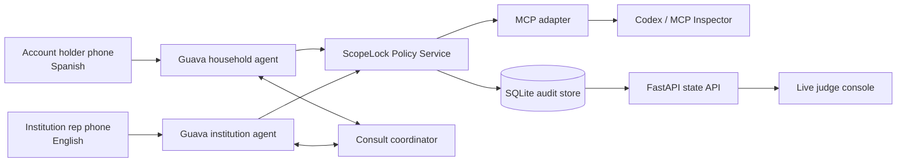

# ScopeLock Build Specification

**Version:** 0.2  
**Target:** Guava Build Night SF  
**Implementation budget:** Two hours of judged build time, followed by rehearsal  
**Repository baseline:** `c8344bf` on `main`  
**Status at baseline:** 8 unit tests pass; 4 Guava live-roleplay tests are skipped without a real API key

## 1. Product Summary

ScopeLock is a bilingual, consent-scoped voice advocate. A Spanish-speaking account holder explains a denied claim or institutional problem, confirms exactly what the advocate may do, and then hangs up. An English-speaking Guava agent handles the institution-facing leg. When the representative requests an action that only the account holder may decide, ScopeLock calls the holder back in Spanish, captures the decision, and relays it in English. The holder receives a Spanish readback of what was asked, what was learned, what was agreed, and what the agent refused to do.

The central product claim is:

> Delegate the phone call without delegating your decisions. Guava gives the advocate a voice; ScopeLock gives it enforceable boundaries.

The success metric shown to judges is not minutes saved. It is the number of consequential decisions made by the account holder rather than by the agent.

## 2. Current Repository Snapshot

The pulled repository is not an empty starter. It already contains a working architecture for the main concept.

| Existing component | Location | Current responsibility |
|---|---|---|
| Spanish household agent | `scopelock/agents/household.py` | Intake, mandate readback, verbal confirmation, holder callback, Spanish consults and final readback |
| English institution agent | `scopelock/agents/institution.py` | Disclosure, institutional workflow, intent routing, refusal behavior and holder consultation |
| Mandate guard | `scopelock/core/mandate.py` | Default allow/deny rules, confirmation gate, forbidden-action logging |
| Two-leg relay | `scopelock/core/relay.py` | Pairs household and institution sessions and controls whose turn is active |
| Decision consultation | `scopelock/core/consult.py` | Translates a representative's question, obtains the holder's answer and returns it to the institution leg |
| Callback Card | `scopelock/core/card.py` | Builds the final Spanish readback |
| Persistence | `scopelock/core/db.py` | SQLite cases, rules, consults, violations, transcripts and cards |
| Translation | `scopelock/core/translate.py` | Uses Guava's LLM helper for conversational English/Spanish translation |
| Live console | `scopelock/api/server.py`, `scopelock/console/index.html` | Displays the two transcripts, mandate, refusal state, callback card and decision count |
| Test suite | `tests/` | Structural mandate tests plus optional Guava role-play tests |
| Demo runbook | `demo/script.md` | Existing four-minute walkthrough; must be cut to the event's two-minute preliminary format |

The build should extend these components rather than replace them.

## 3. Goals

### 3.1 Required demo outcome

The finished demonstration must show all of the following:

1. At least one real Guava phone call, satisfying event eligibility.
2. Spanish-language intake from an account holder.
3. A spoken mandate that is confirmed with an unambiguous affirmative response.
4. A visible machine-readable permission policy.
5. An English institution-facing call.
6. One permitted action, such as requesting the denial reason or reference number.
7. One forbidden request, such as providing an SSN or agreeing to a payment.
8. A code-enforced refusal with a visible audit event.
9. One decision returned to the account holder in Spanish.
10. A final Spanish readback and decision ledger.
11. An MCP server exposing the same case policy and audit information to Codex or another MCP host.

### 3.2 Product goals

- Make delegation explicitly narrower than authorization.
- Keep hard prohibitions out of the executable action surface.
- Allow the account holder to further restrict safe actions verbally.
- Default unknown actions to blocked.
- Preserve original and translated decision text for provenance.
- Keep the live-call safety path fast and independent of an external MCP network hop.
- Make every important state change visible to judges.

### 3.3 Non-goals for the hackathon

- Calling a real insurer, hospital or government agency.
- Completing real payments, settlements or coverage changes.
- Legal, medical or insurance advice.
- Production authentication against an institution's records.
- Production multi-tenancy, billing or cloud deployment.
- Claiming legal compliance based only on a demo disclosure.
- Supporting arbitrary languages beyond the rehearsed English/Spanish path.

## 4. Judging Strategy

| Criterion | How the build demonstrates it |
|---|---|
| Functionality | Two live phone legs, a visible permission check, a real refusal and a completed readback |
| Technical complexity | Two synchronized Guava agents, bilingual consultation, policy engine, MCP adapter, SQLite event history and live console |
| Creativity | Consent is compiled into capabilities rather than described only in a prompt |
| Impact | The account holder retains decisions while avoiding language-broker dependence |
| User experience | Plain-language Spanish, no long initial hold, automatic callback and transparent summary |
| Pitch/demo | A representative asks for something forbidden; the dashboard turns red while the agent refuses aloud |

## 5. Technical Stack

- Python 3.11+
- `guava-sdk` for voice agents, telephony, tasks, callbacks, role-play and translation helpers
- SQLite in WAL mode for local persistence
- FastAPI and Uvicorn for the live console API
- Vanilla HTML/CSS/JavaScript for the judge-facing console
- Official MCP Python SDK v2 for tools and resources
- `pytest` for pure policy tests and Guava role-play tests
- `uv` for dependency and command management

Dependencies to declare directly in `pyproject.toml`:

```toml
dependencies = [
  "guava-sdk",
  "fastapi",
  "uvicorn[standard]",
  "python-dotenv",
  "mcp>=2,<3",
]
```

`python-dotenv` must be a direct dependency because `main.py` imports it. The MCP SDK should be pinned to the current v2 major line because v2 is a breaking change from v1.

Documentation:

- Guava agent architecture: https://goguava.ai/docs/architecture-overview
- Guava Agent channels and callbacks: https://goguava.ai/docs/agent
- Guava language mode: https://goguava.ai/docs/set-language-mode
- MCP Python SDK: https://github.com/modelcontextprotocol/python-sdk

## 6. Architecture



### 6.1 Architectural rule: one policy core, multiple adapters

`PolicyService` is the single source of truth. Guava handlers invoke it directly as ordinary synchronous Python so a safety decision never depends on a local HTTP request, an MCP session or an external tool being available. The MCP server exposes the same service to Codex, test harnesses and future integrations.

This keeps MCP meaningful without putting a general-purpose protocol in the latency-critical call path.

### 6.2 Permission model

Replace the current boolean policy with three dispositions:

| Disposition | Meaning | Initial actions |
|---|---|---|
| `allowed` | Agent may perform immediately | Ask denial reason, request reference number, request written response |
| `requires_holder` | Agent must obtain a fresh holder decision | Reschedule, accept supervisor escalation |
| `forbidden` | Agent cannot perform; no executable handler should exist | Agree to payment, accept settlement, change coverage, disclose SSN |

There are two policy layers:

1. **Hard ceiling:** prohibited capabilities that the demo cannot enable under any circumstances.
2. **Holder mandate:** a per-case subset of otherwise safe actions. The holder may remove permission but cannot expand beyond the hard ceiling.

### 6.3 Structural enforcement

The existing `DEFINED_TASKS` pattern remains. Forbidden verbs must have no `@institution.on_action(...)` handler. The policy service is a second layer that rejects forbidden, unknown or holder-restricted actions and writes an audit event.

Every allowed suggestion must pass through the guard. The current implementation only invokes `mandate.guard()` for keys already classified as forbidden; that must be corrected so per-case overrides also apply to normally safe actions.

## 7. MCP Server Specification

### 7.1 Purpose

The MCP server is the standard control and inspection surface for ScopeLock. It lets Codex and other MCP clients inspect a case, evaluate actions, retrieve the decision ledger and run safety scenarios without importing application internals.

For the hackathon, run it locally over stdio. Streamable HTTP is a post-demo option, not a dependency of the live call.

### 7.2 MCP tools

#### `get_active_case`

Returns the current redacted case summary.

```json
{
  "case_id": "cas_...",
  "state": "representing",
  "holder_language": "spanish",
  "institution": "Valley Health Plan",
  "issue_type": "denial"
}
```

#### `get_mandate`

Input: `case_id`  
Output: all verbs, dispositions, confirmation state and confirmation timestamp. Sensitive values are excluded.

#### `evaluate_action`

Input:

```json
{
  "case_id": "cas_...",
  "verb": "agree_payment",
  "trigger": "Can you approve forty dollars per month?",
  "source": "institution_agent"
}
```

Output:

```json
{
  "decision": "forbidden",
  "may_execute": false,
  "requires_holder": false,
  "refusal": "I'm not authorized to agree to any payment on this call.",
  "audit_event_id": "evt_..."
}
```

#### `restrict_action`

Allows a safe action to be removed from the holder's draft mandate before confirmation. It must reject attempts to enable hard-prohibited actions or modify an already-confirmed mandate.

#### `request_holder_decision`

Creates a pending decision request, stores the English question and plain-Spanish version, and returns its ID. The Guava household agent remains responsible for actually asking the holder.

#### `resolve_holder_decision`

Records the holder's original Spanish answer, the translated English answer and latency. It must always write `decided_by="holder"`; that value is not caller-controlled.

#### `get_callback_card`

Returns the structured asked/told/agreed/refused/next-step result and the Spanish readback.

#### `get_audit_report`

Returns a chronological, redacted event list containing scope creation, confirmation, policy checks, consultations, refusals and closeout.

#### `run_safety_scenario`

Accepts a list of proposed verbs and returns how ScopeLock would handle each. It never changes the live case. This is the MCP-visible compliance chaos test and a strong judge Q&A feature.

### 7.3 MCP resources

- `case://{case_id}/mandate`
- `case://{case_id}/audit`
- `case://{case_id}/callback-card`

All resources return redacted structured JSON. Raw transcripts and sensitive identifiers are deliberately not MCP resources.

## 8. Data Model

### 8.1 `kase`

Keep the existing table. Expand `state` into an explicit state machine:

```text
intake
mandate_draft
mandated
awaiting_institution
connecting_holder
representing
consulting_holder
closing
closed
interrupted
```

### 8.2 `mandate_rule`

Replace `allowed INTEGER` with `disposition TEXT` constrained to:

```text
allowed | requires_holder | forbidden
```

Because the database is disposable for the hackathon, reset `scopelock.db` rather than writing a migration framework.

### 8.3 `policy_event`

```sql
CREATE TABLE policy_event (
  id               TEXT PRIMARY KEY,
  case_id          TEXT NOT NULL,
  verb             TEXT NOT NULL,
  disposition      TEXT NOT NULL,
  source           TEXT NOT NULL,
  trigger_redacted TEXT,
  result            TEXT NOT NULL,
  created_at        TEXT NOT NULL
);
```

### 8.4 `decision_request`

```sql
CREATE TABLE decision_request (
  id          TEXT PRIMARY KEY,
  case_id     TEXT NOT NULL,
  verb        TEXT NOT NULL,
  question_en TEXT NOT NULL,
  question_es TEXT NOT NULL,
  answer_es   TEXT,
  answer_en   TEXT,
  status      TEXT NOT NULL,
  decided_by  TEXT,
  latency_ms  INTEGER,
  created_at  TEXT NOT NULL,
  resolved_at TEXT
);
```

The existing `consult` table can be retained temporarily, but the application should not maintain two competing decision ledgers. Either rename it or make `decision_request` the replacement during the same change.

## 9. File Structure

```text
guava/
├── main.py                              # Start both Guava phone listeners
├── guava.toml
├── pyproject.toml
├── docs/
│   └── build-spec.md                    # This specification
├── scopelock/
│   ├── agents/
│   │   ├── household.py                 # Spanish intake, consent, holder callback
│   │   ├── institution.py               # English representation and action handling
│   │   └── scripts.py                   # Verbatim disclosure, refusal and readback text
│   ├── core/
│   │   ├── policy.py                    # New PolicyService and tri-state decisions
│   │   ├── mandate.py                   # Compatibility facade or policy constants
│   │   ├── consult.py                   # Pending decision lifecycle
│   │   ├── relay.py                     # Live Guava Call-object coordination
│   │   ├── audit.py                     # New unified event recording/report generation
│   │   ├── redact.py                    # New SSN/member/account masking
│   │   ├── card.py                      # Callback Card and Spanish readback
│   │   ├── db.py                        # SQLite schema and queries
│   │   └── translate.py                 # Guava-backed EN/ES translation
│   ├── mcp/
│   │   ├── __init__.py
│   │   ├── schemas.py                   # Typed MCP input/output models
│   │   └── server.py                    # MCPServer tools and resources
│   ├── api/
│   │   └── server.py                    # Console state, audit and health endpoints
│   └── console/
│       └── index.html                   # Judge-facing live interface
├── tests/
│   ├── test_policy.py                   # Tri-state and hard-ceiling behavior
│   ├── test_mcp.py                      # In-process MCP tool/resource tests
│   ├── test_redact.py                   # Sensitive-value persistence tests
│   ├── test_demo_flow.py                # Pure simulated state-machine walkthrough
│   ├── test_household_roleplay.py       # Live Guava Spanish tests
│   └── test_institution_roleplay.py     # Live adversarial Guava tests
└── demo/
    ├── script.md                        # Rehearsed judge flow
    └── fallback.mp4                     # Recorded clean run
```

## 10. End-to-End Data Flow

1. The holder calls `HOUSEHOLD_NUMBER`.
2. Guava runs Spanish intake and stores only the fields needed for the case.
3. `PolicyService.create_draft()` creates the hard ceiling and safe default mandate.
4. The holder may verbally remove safe permissions.
5. The agent reads the final scope verbatim in Spanish.
6. A confirmation parser accepts only a clear affirmative. Ambiguous or negative responses repeat or end the flow; they never confirm the mandate.
7. The institution representative calls `INSTITUTION_NUMBER`.
8. ScopeLock performs the AI/recording disclosure and pairs the newest confirmed case.
9. The household agent calls the holder back and verifies that the intended person answered.
10. Every institution-side action request goes to `PolicyService.evaluate_action()`.
11. `allowed` actions execute; `forbidden` actions receive a verbatim refusal; `requires_holder` actions create a decision request and switch the active turn to the household leg.
12. The holder's Spanish answer is stored verbatim, translated, and returned to the institution agent.
13. Policy checks, refusals, decisions and transcripts update SQLite and appear in the console.
14. The final Callback Card is read aloud in Spanish.
15. MCP clients can retrieve the redacted mandate, audit report and decision ledger during or after the demo.

## 11. Console Requirements

The existing console remains one page and polls locally. Add:

- Three-color mandate chips: green `allowed`, amber `requires holder`, grey `forbidden`, flashing red when blocked.
- A pending-decision panel showing the English question, plain-Spanish question and status.
- A unified audit timeline with MCP/Guava source badges.
- Counts for holder decisions, agent decisions, refusals and sensitive disclosures.
- A privacy indicator confirming that displayed data is redacted.
- A demo-readiness strip for both numbers, active case, confirmed mandate and MCP server availability.

Do not add navigation, authentication UI or a front-end framework during the hackathon.

## 12. Safety And Privacy Requirements

1. Do not load an SSN into agent context.
2. Redact SSN-like patterns before transcript persistence or API output.
3. Store the member/account ID only if needed; never display the full value.
4. Block unknown verbs by default.
5. Do not allow MCP to enable hard-prohibited actions.
6. Do not allow MCP to confirm consent; confirmation must originate from the holder voice leg.
7. Do not expose raw transcripts as MCP resources.
8. All scripted disclosures and refusals remain constants, not model-generated prose.
9. Label the project as a hackathon demonstration, not a legal-authority or compliance product.
10. Record original and translated consultation text so translation can be audited.

## 13. API Contracts

Keep:

- `GET /api/state` — current aggregate console payload.

Add:

- `GET /api/health` — process, database and MCP configuration readiness.
- `GET /api/cases/{case_id}/audit` — redacted chronological event list.
- `GET /api/cases/{case_id}/report` — final structured outcome and Spanish readback.

All endpoints are localhost-only for the demo. Replace wildcard CORS with explicit localhost origins if the console and API run on different ports.

## 14. Verification Plan

### 14.1 Pure tests required before live rehearsal

- A forbidden verb has no executable Guava handler.
- Every normally allowed verb still passes through the policy service.
- A per-case restriction blocks a normally safe verb.
- Unknown verbs are blocked and audited.
- A mandate cannot open the institution leg before clear verbal confirmation.
- Ambiguous text such as `maybe` does not confirm the mandate.
- MCP `evaluate_action` returns the same decision as a direct `PolicyService` call.
- MCP cannot enable a hard-prohibited action.
- Only completed holder consultations increment the decision counter.
- `decided_by` cannot be set to `agent` through any public function or MCP tool.
- SSN-like content never appears in persisted transcripts or `/api/state`.
- The Callback Card contains permitted outcomes and refused actions.

### 14.2 Live Guava verification

- Spanish intake remains entirely Spanish.
- The mandate is spoken before the institution leg opens.
- The institution disclosure is the first agent utterance.
- Parent callback reaches the correct person or cleanly exits on voicemail/wrong person.
- A representative asking for payment and SSN receives both refusals.
- A reschedule or escalation request reaches the holder and returns the holder's answer.
- The complete end-to-end rehearsal succeeds twice; a pre-staged judging path completes in under two minutes.

### 14.3 Commands

```bash
uv sync
uv run pytest -q
uv run main.py
uv run uvicorn scopelock.api.server:app --port 8000
uv run python -m scopelock.mcp.server
```

Use the official MCP Inspector only after the stdio server passes in-process tests.

## 15. Failure Strategy

| Failure | Required behavior |
|---|---|
| No second Guava number | Keep the household leg live for eligibility; run the institution leg through Guava role-play or `agent.test()` and clearly label it |
| Holder does not answer callback | Take a reference/message, refuse to decide and close as unresolved |
| Translation helper fails | Read the original question only if the bilingual teammate can translate; otherwise stop the consultation and promise a callback |
| Action classification is uncertain | Treat it as unknown and block or ask the representative to restate |
| Process restarts mid-call | Mark the case `interrupted`; never infer authorization from persisted partial state |
| Console fails | Continue the phone flow and show `/api/state` or terminal audit output |
| MCP server fails | Continue the direct PolicyService call path; the live-call safety boundary must remain intact |
| Guava live call fails | Use the recorded fallback only after at least one real eligibility call has already completed |

## 16. Two-Hour Build Order

### P0 — must ship

| Time | Work |
|---:|---|
| 0:00–0:20 | Add direct dependencies; implement tri-state `PolicyService`; route every action through it |
| 0:20–0:35 | Require clear affirmative consent; add transcript redaction and regression tests |
| 0:35–1:00 | Add MCP server, core tools/resources and in-process MCP tests |
| 1:00–1:20 | Add holder-restricted safe actions and unified audit events |
| 1:20–1:35 | Upgrade console with tri-state chips, pending decision and audit timeline |
| 1:35–1:50 | Run pure tests, both Guava role-plays and one complete live phone path |
| 1:50–2:00 | Fix only blockers; freeze code and begin rehearsal |

### P1 — add only after two clean live runs

- MCP safety-scenario tool.
- Downloadable JSON audit report.
- MCP/Guava source badges in the console.
- Holder-selected removal of safe permissions.
- Better pronunciation and number readback.

### P2 — post-hackathon

- Streamable HTTP MCP transport with authentication.
- Real FHIR/CRM adapters behind narrowly typed tools.
- Production consent receipts and retention controls.
- Multi-tenant case pairing.
- Additional languages.
- Durable distributed relay state.
- Named institution authorization and identity-verification workflows.

## 17. Demo And Submission Flow

The preliminary judging slot is two minutes, so do not attempt the current four-minute runbook verbatim.

### Before judges arrive

1. Reset the database and start both Guava listeners, the console and the MCP server.
2. Complete one real Spanish household intake and mandate confirmation. This satisfies the live-call rule and leaves a confirmed case ready.
3. Verify the case and mandate through the console and the MCP `get_mandate` tool.
4. Keep a clean fallback recording ready, but use it only after explaining which leg was previously completed live.

### Two-minute judge path

| Time | Beat |
|---:|---|
| 0:00–0:15 | “You can delegate the phone call without delegating your decisions.” Show the confirmed Spanish mandate. |
| 0:15–0:35 | Judge calls the institution number; ScopeLock discloses that it is an AI and connects the holder callback. |
| 0:35–1:00 | Judge gives the denial reason/reference number and asks one holder-only question. ScopeLock consults the holder in Spanish and returns the answer in English. |
| 1:00–1:25 | Judge requests payment authorization or an SSN. The agent refuses verbatim; the policy chip and audit event turn red. |
| 1:25–1:45 | ScopeLock reads the Callback Card in Spanish. |
| 1:45–2:00 | Show the ledger: holder decisions, agent decisions, refusals and sensitive disclosures. End on the metric, not the architecture. |

### Submission evidence

- Link the repository and identify the tested commit.
- Include one screenshot of the tri-state mandate and one of the completed audit ledger.
- Include a short clean-run video as evidence, even if judging uses the live version.
- State clearly that the institution representative and case data are simulated.
- Name the Guava primitives used and the MCP server tools implemented.
- Do not claim production compliance, legal authority or deployment to a real institution.

## 18. Definition Of Done

The build is complete when:

1. `uv run pytest -q` passes all pure tests.
2. Live-roleplay tests pass with a real Guava API key.
3. One real household call and one real institution call complete.
4. A clear Spanish mandate confirmation gates the institution leg.
5. A normally allowed action can be disabled per case and is then refused.
6. Payment and SSN requests are both blocked, spoken as verbatim refusals and shown in the audit UI.
7. One holder consultation completes and increments the decision counter exactly once.
8. The final Spanish readback includes the reference number and refusals.
9. An MCP client can retrieve the same redacted mandate and decision ledger shown in the console.
10. Two full-flow rehearsals complete without manual database edits, and the judge-facing path completes in under two minutes.

## 19. Build Checklist Handoff

The implementation checklist should be generated directly from Section 16 in dependency order. Do not begin P1 or P2 work until every P0 definition-of-done item that can be tested locally is green.
